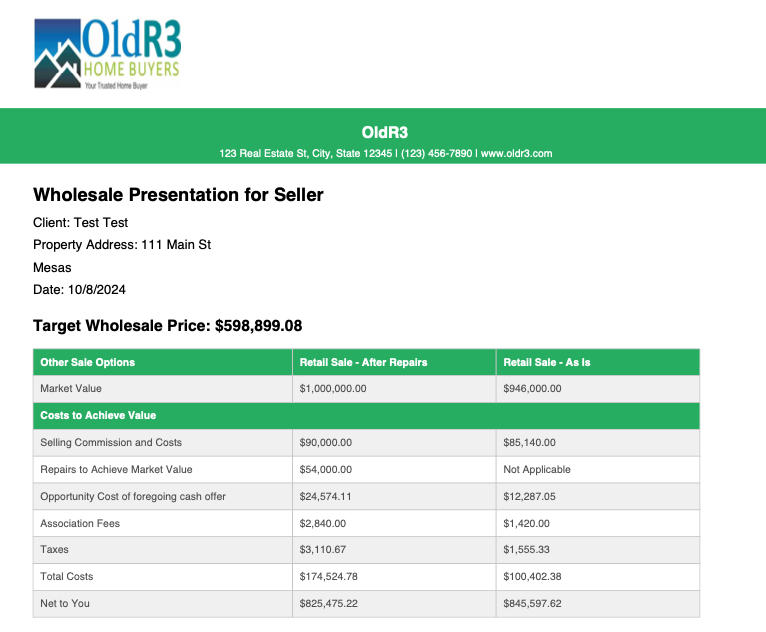
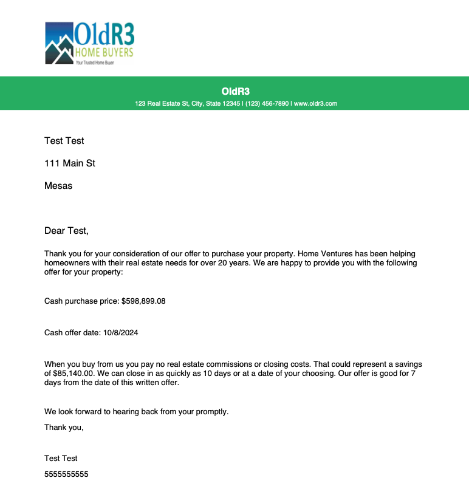

# Property Price Estimator

## Table of Contents
- [Project Overview](#project-overview)
- [Features](#features)
- [Technologies Used](#technologies-used)
- [Getting Started](#getting-started)
  - [Prerequisites](#prerequisites)
  - [Installation](#installation)
- [How to Use](#how-to-use)
- [Code Structure](#code-structure)
- [Contributing](#contributing)
- [License](#license)
- [Contact](#contact)

## Project Overview

The Property Price Estimator is a web application designed to streamline the process of estimating property purchase prices. It provides a user-friendly interface for sellers and agents to input property details and generates detailed offer presentations, including both retail and wholesale price estimates.

**Live Application:** [Property Price Estimator](https://property-price-estimator.netlify.app/)

## Features

- **Property Purchase Price Estimation:** Generates retail and wholesale price estimates based on inputs such as ARV (After Repair Value), holding period, and renovation costs.
- **PDF Generation:** Automatically creates PDF documents for both retail and wholesale offers, with separate versions for sellers and agents.
- **Email Integration:** Allows seamless emailing of offer letters in PDF format to sellers, including detailed offer presentations.
- **Responsive Design:** Optimized for use on both desktop and mobile devices.
- **Google Sheets Integration:** Utilizes Google Sheets for data storage and complex calculations.
- **Secure Authentication:** Implements Google OAuth for user authentication.

## Technologies Used

### Frontend:
- HTML5, CSS3, JavaScript
- Bootstrap 5 for responsive layout and styling
- Google OAuth for secure user authentication
- JS libraries: 
  - jsPDF and jsPDF-AutoTable for generating PDFs
  - HTML2Canvas for capturing and converting DOM elements to images in PDFs

### Backend:
- Google Sheets API for dynamic data storage and retrieval
- Netlify Functions (serverless) for email sending using SendGrid

### Deployment:
- Hosted on Netlify

## Screenshots

Here are some screenshots of the Property Price Estimator in action:

### Offer Letter


*Figure 1: Interface for viewing and managing multiple offers*

---

### Presentation to Seller


*Figure 2: Sample offer letter or presentation generated by the application*

---

### View Offers


*Figure 3: Detailed presentation of offer details to the seller*

## Getting Started

### Prerequisites

1. **Google OAuth Credentials:** Set up Google OAuth and obtain a client ID. [Google OAuth Setup Guide](https://developers.google.com/identity/sign-in/web/sign-in)
2. **SendGrid API Key:** Create a SendGrid account and obtain an API key. [SendGrid API Guide](https://sendgrid.com/docs/API_Reference/api_getting_started.html)
3. **Google Sheets API:** Enable the Sheets API and obtain necessary credentials. [Google Sheets API Quickstart](https://developers.google.com/sheets/api/quickstart/js)

### Installation

1. Clone the repository:
   ```bash
   git clone https://github.com/yourusername/property-price-estimator.git
   ```

2. Navigate to the project folder:
   ```bash
   cd property-price-estimator
   ```

3. Install dependencies (if applicable):
   ```bash
   npm install
   ```

4. Set up your environment variables in a `.env` file:
   ```
   GOOGLE_CLIENT_ID=your-google-client-id
   SENDGRID_API_KEY=your-sendgrid-api-key
   SHEETS_API_KEY=your-google-sheets-api-key
   ```

5. Deploy the application using Netlify or your preferred hosting service.

## How to Use

1. **Log in with Google:** Use your Google account to authenticate.
2. **Fill in Property Details:** Input essential information such as owner details, property specifics, and agent information.
3. **Generate Offers:** The tool will create retail and wholesale offer options based on the form inputs.
4. **Download PDFs:** Access and download detailed offer presentations in PDF format for sharing with sellers or agents.
5. **Email Offers:** Send offer letters via email with the generated PDF offer attached.

## Code Structure

Here's an overview of the main JavaScript components:

### Form Handler

```javascript
// Form Submission Handler
document.getElementById('propertyForm').addEventListener('submit', function(event) {
    event.preventDefault();

    const formData = {
        ownerFirstName: document.getElementById('ownerFirstName').value,
        ownerLastName: document.getElementById('ownerLastName').value,
        ownerEmail: document.getElementById('ownerEmail').value,
        // ... other form fields ...
    };

    console.log('Form Data:', formData);

    if (!formData.ownerEmail) {
        alert('Please provide the owner\'s email address.');
        return;
    }

    if (accessToken) {
        Promise.all([
            sendDataToGoogleSheets(formData, accessToken),
            sendDataToOfferSheet(formData, accessToken)
        ]).then(() => {
            setTimeout(() => {
                fetchAndPopulateOfferData(accessToken, formData)
                    .then(data => {
                        offerData = {
                            ...data,
                            ownerEmail: formData.ownerEmail,
                            clientName: `${formData.ownerFirstName} ${formData.ownerLastName}`
                        };
                        console.log('Offer Data:', offerData);
                        showOfferOptionsModal();
                        document.getElementById('viewOffersButton').style.display = 'block';
                    })
                    .catch(error => {
                        console.error('Error fetching offer data:', error);
                        alert('An error occurred while fetching the offer data. Please try again.');
                    });
            }, 2000);
        }).catch(error => {
            console.error('Error during data submission:', error);
            alert('An error occurred while submitting the data. Please try again.');
        });
    } else {
        alert('You need to log in first.');
    }
});

// Form validation
(function () {
    'use strict'
    
    var forms = document.querySelectorAll('.needs-validation')
    
    Array.prototype.slice.call(forms)
        .forEach(function (form) {
            form.addEventListener('submit', function (event) {
                if (!form.checkValidity()) {
                    event.preventDefault()
                    event.stopPropagation()
                }
    
                form.classList.add('was-validated')
            }, false)
        })
})();
```

### PDF Generation

```javascript
async function generateOfferLetterPDF(type) {
    console.log(`Generating ${type} Offer Letter PDF`);
    if (!offerData) {
        console.error('Offer data is not available');
        alert('Unable to generate PDF. Please try submitting the form again.');
        return;
    }

    const logoUrl = '/images/OldR3-logo.jpeg';
    const logoDataUrl = await getImageDataUrl(logoUrl);

    const { jsPDF } = window.jspdf;
    const doc = new jsPDF();
    // ... PDF generation logic ...

    doc.save(`${type}_Offer_Letter_${offerData.clientName.replace(/\s+/g, '_')}.pdf`);
}
```

### Email Sending

```javascript
async function sendOfferLetterEmail(type) {
    try {
        if (!offerData || !offerData.ownerEmail) {
            console.error('Owner email is missing:', offerData);
            throw new Error('Owner email is missing. Cannot send email.');
        }

        const pdfBlob = await generateOfferLetterPDFBlob(type);
        const pdfBase64 = await blobToBase64(pdfBlob);

        const emailData = {
            email: offerData.ownerEmail,
            subject: `${type} Offer Letter for ${offerData.propertyAddress}`,
            message: `Please find attached the ${type} offer letter for ${offerData.propertyAddress}.`,
            attachment: {
                content: pdfBase64,
                filename: `${type}_Offer_Letter_${offerData.clientName.replace(/\s+/g, '_')}.pdf`,
                type: 'application/pdf',
                disposition: 'attachment'
            }
        };

        console.log('Sending email with data:', emailData);

        const response = await fetch('/.netlify/functions/sendEmail', {
            method: 'POST',
            headers: {
                'Content-Type': 'application/json'
            },
            body: JSON.stringify(emailData)
        });

        const result = await response.json();

        if (response.ok) {
            console.log('Email sent successfully:', result);
            alert('Email sent successfully!');
        } else {
            throw new Error(result.message || 'Failed to send email');
        }
    } catch (error) {
        console.error('Error sending email:', error);
        alert('An error occurred while sending the email: ' + error.message);
    }
}
```

## Contributing

Contributions are welcome! Please follow these steps:

1. Fork the repository
2. Create a new branch: `git checkout -b feature-branch-name`
3. Make your changes and commit them: `git commit -m 'Add some feature'`
4. Push to the branch: `git push origin feature-branch-name`
5. Submit a pull request

Please ensure your code adheres to the existing style and include appropriate test coverage.

## License

This project is licensed under the MIT License. See the [LICENSE](LICENSE) file for details.

## Contact

If you have any questions or need further assistance, feel free to reach out:

- **Email:** designer@ontoplocal.com
- **Website:** [OnTopLocal](https://www.ontoplocal.com)

---

Thank you for using the Property Price Estimator!
